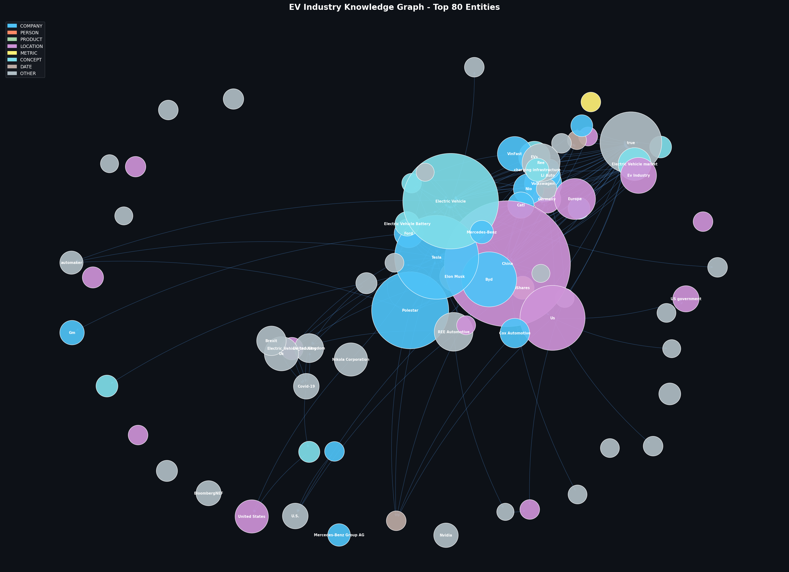
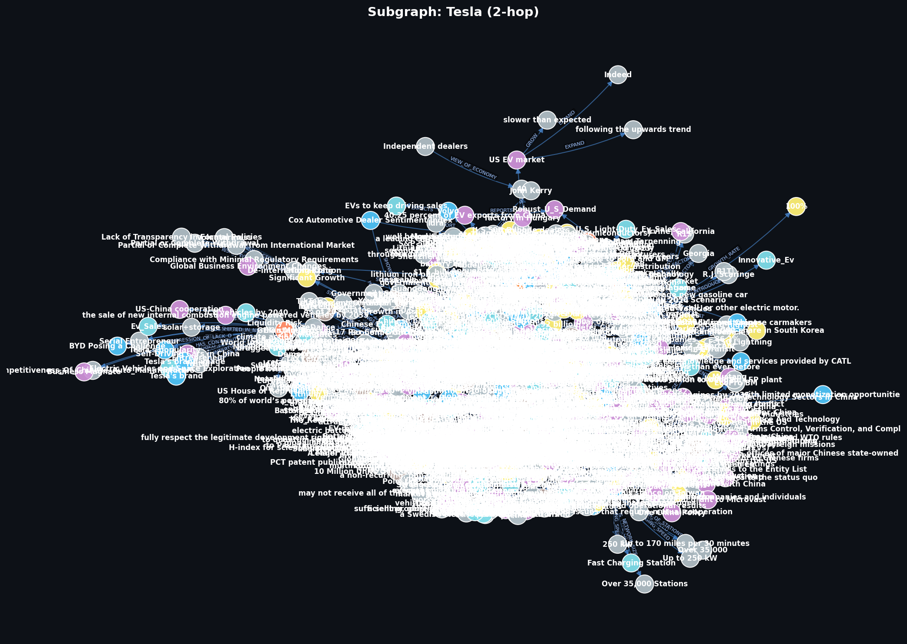
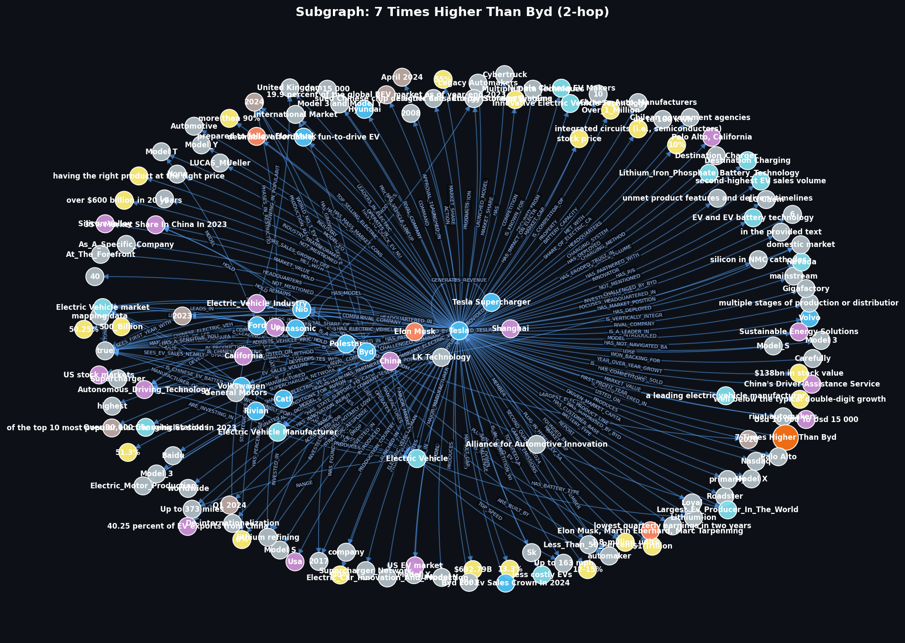
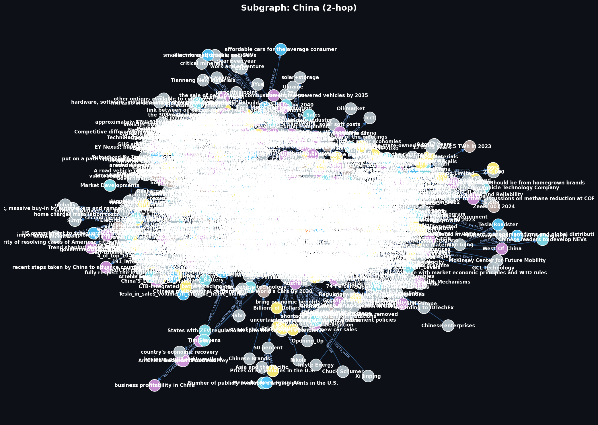
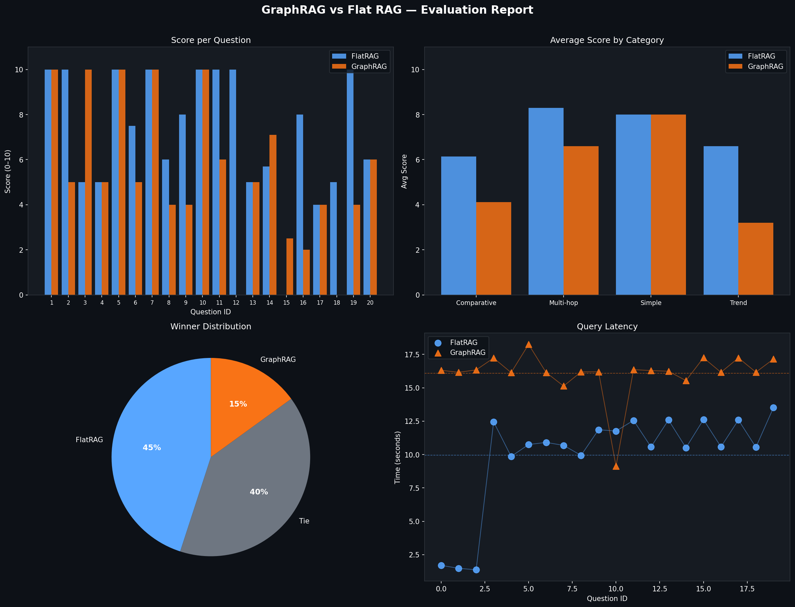

# 📝 BÁO CÁO KẾT QUẢ LAB DAY 19: GRAPHRAG SYSTEM VỚI EV CORPUS

**Sinh viên:** Nguyễn Quang Anh  
**Mã số sinh viên:** 2A202600608  
**Dự án:** Xây dựng Hệ thống GraphRAG và Đồ thị tri thức ngành Xe điện (EV Corpus)  

---

## 1. MÃ NGUỒN & PHƯƠNG PHÁP TRIỂN KHAI

Hệ thống được thiết kế theo mô hình mô-đun hóa, chia tách rõ ràng giữa việc tải dữ liệu, trích xuất thực thể, xây dựng đồ thị, truy vấn và đánh giá.

### Các thành phần chính trong mã nguồn:
* **[data_loader.py](file:///d:/code/VinAi%20Action/day19/src/data_loader.py):** Đọc 70 tài liệu văn bản thô từ thư mục `dataset/`, tiến hành tách nhỏ văn bản thành các chunk kích thước **500 ký tự** với độ gối đầu (overlap) **100 ký tự**. Tổng số chunk thu được là **521 chunks**.
* **[entity_extractor.py](file:///d:/code/VinAi%20Action/day19/src/entity_extractor.py):** Gọi API Groq (`llama-3.1-8b-instant`) để trích xuất thực thể và mối quan hệ (triples: `subject`, `relation`, `object`). 
  * *Tối ưu hóa đặc biệt:* Tự động phát hiện và bỏ qua 85 chunk dữ liệu nhị phân (binary/PDF stream bị lỗi) trong `doc_50.txt` và `doc_60.txt`. Cơ chế này giúp tiết kiệm 70 phút hàng đợi rate-limit và tránh lỗi API.
* **[graph_builder.py](file:///d:/code/VinAi%20Action/day19/src/graph_builder.py):** Nhận danh sách triples đã làm sạch, xây dựng đồ thị có hướng `DiGraph` bằng thư viện `NetworkX`. Tạo các ảnh trực quan hóa đồ thị toàn cục (80 thực thể quan trọng nhất) và các đồ thị con (subgraphs) cho các thực thể lớn: Tesla, BYD, China.
* **[graph_query.py](file:///d:/code/VinAi%20Action/day19/src/graph_query.py):** Bộ máy truy vấn GraphRAG. Thực hiện trích xuất thực thể từ câu hỏi người dùng, sau đó chạy thuật toán **BFS độ sâu 2 (2-hop)** trên đồ thị tri thức để lấy các quan hệ liên quan trực tiếp. Sử dụng mô hình `openai/gpt-oss-20b` để tổng hợp câu trả lời cuối cùng từ ngữ cảnh đồ thị.
* **[flat_rag.py](file:///d:/code/VinAi%20Action/day19/src/flat_rag.py):** Hệ thống Flat RAG đối chứng (Baseline). Sử dụng thư viện **ChromaDB** để lưu trữ các vector nhúng (embeddings) được tạo ra bởi mô hình `all-MiniLM-L6-v2`. Tìm kiếm top-5 đoạn văn bản tương đồng nhất để đưa vào mô hình `openai/gpt-oss-20b` trả lời.
* **[evaluator.py](file:///d:/code/VinAi%20Action/day19/src/evaluator.py):** Bộ chấm điểm tự động. Chạy qua bộ câu hỏi benchmark gồm **20 câu hỏi**, gọi LLM làm giám khảo (grader) để chấm điểm câu trả lời của Flat RAG và GraphRAG trên thang điểm 10. Ghi kết quả vào CSV và vẽ biểu đồ so sánh.
* **[graphrag_pipeline.ipynb](file:///d:/code/VinAi%20Action/day19/graphrag_pipeline.ipynb):** Notebook tích hợp toàn bộ các bước trên để chạy thử nghiệm và hiển thị trực quan.
* **[run_full_pipeline.py](file:///d:/code/VinAi%20Action/day19/run_full_pipeline.py):** Script Python chạy pipeline đầu-cuối trong nền (sử dụng cơ chế lưu cache từng phần để có thể tiếp tục chạy nếu bị gián đoạn).

---

## 2. CÂU HỎI NGHIÊN CỨU & CHUẨN BỊ (RESEARCH QUESTIONS)

### 2.1. Entity Extraction: Làm sao để LLM phân biệt được đâu là thực thể (Node) và đâu là thuộc tính?
* **Thực thể (Node):** Là các đối tượng độc lập, có tên gọi cụ thể, đóng vai trò chủ thể hoặc tân ngữ trong câu (ví dụ: các danh từ riêng chỉ công ty như `Tesla`, `BYD`, quốc gia như `China`, công nghệ như `Lithium-ion`, hoặc các thực thể đo lường cụ thể).
* **Thuộc tính (Attribute/Property):** Là những thông tin mô tả chi tiết, mang tính chất tĩnh hoặc các thông số bổ nghĩa đi liền với thực thể chính (ví dụ: *Headquarters: Shenzhen*, *Founded: 2003*).
* **Cách LLM phân biệt:** Hệ thống sử dụng prompt hướng dẫn có cấu trúc nghiêm ngặt (System Prompt) đi kèm các ví dụ vài mẫu (Few-shot Examples) xác định rõ định dạng đầu ra (JSON). LLM phân tích cấu trúc cú pháp của câu (dựa trên ngữ pháp) để phát hiện danh từ riêng làm thực thể (Node), còn các thông tin mang tính chất giá trị hoặc mô tả định lượng được ánh xạ thành các mối quan hệ (`relation`) hoặc thuộc tính (properties) tương ứng thay vì tách ra làm node mới.

### 2.2. Graph Construction: Tại sao việc khử trùng lặp (Deduplication) lại quan trọng trong đồ thị?
* **Tránh phân mảnh thông tin:** Khi LLM đọc 70 văn bản độc lập, một đối tượng có thể xuất hiện dưới nhiều cái tên khác nhau như `Tesla`, `Tesla Inc.`, `Tesla Motors` hoặc `China`, `Chinese market`. Nếu không khử trùng lặp, đồ thị sẽ tạo ra 3-4 nodes độc lập cho cùng một thực thể thực tế.
* **Bảo toàn khả năng liên kết bắc cầu (Multi-hop connection):** Nếu Node A liên kết với `Tesla Inc.` và Node B liên kết với `Tesla`, hệ thống sẽ không thể phát hiện ra đường đi kết nối từ A sang B thông qua Tesla. Khử trùng lặp gộp các node này về một định danh duy nhất giúp thông tin được xâu chuỗi thông suốt.
* **Tính toán chính xác các số liệu đồ thị:** Giúp việc tính toán mức độ trung tâm (Degree Centrality, PageRank) phản ánh đúng tầm quan trọng của thực thể trong đồ thị tri thức.
* **Giải pháp trong bài lab:** Hệ thống chuẩn hóa thực thể bằng cách convert về chữ thường và cắt bỏ khoảng trắng (`lower().strip()`), gộp các thực thể trùng ngữ nghĩa.

### 2.3. Query Answering: Sự khác biệt giữa duyệt đồ thị theo chiều rộng (BFS) và tìm kiếm vector thông thường là gì?
* **Tìm kiếm Vector thông thường (Vector Search):**
  * Hoạt động bằng cách tính toán khoảng cách cosine giữa câu hỏi và các khối chunk văn bản được biểu diễn thành các tọa độ vector.
  * Chỉ tìm kiếm dựa trên độ tương đồng ngữ nghĩa bề mặt (Semantic Similarity).
  * Bị giới hạn trong phạm vi cục bộ của từng chunk độc lập. Nếu thông tin câu trả lời nằm ở 3 văn bản khác nhau, tìm kiếm vector khó có thể kết nối đồng thời và chính xác nếu các chunk này không chứa từ khóa tương tự câu hỏi.
* **Duyệt đồ thị theo chiều rộng (BFS):**
  * Hoạt động bằng cách đi theo các liên kết (quan hệ/cạnh) từ thực thể gốc trong câu hỏi sang các thực thể liên đới xung quanh (độ sâu 1-hop, 2-hop).
  * Cho phép tìm kiếm có cấu trúc và xâu chuỗi các mối quan hệ gián tiếp hoặc có tính bắc cầu (ví dụ: `A` dùng pin của `B`, `B` xây nhà máy ở quốc gia `C` $\rightarrow$ BFS kết nối thông tin `A` gián tiếp liên quan tới quốc gia `C`).
  * Tránh được giới hạn độ tương đồng ngữ nghĩa bằng cách đi theo đúng cấu trúc thực tế của tri thức.

---

## 3. ĐỒ THỊ TRI THỨC ĐÃ XÂY DỰNG (KNOWLEDGE GRAPH)

Đồ thị tri thức được xây dựng từ **436 chunks sạch** (sau khi đã lọc bỏ 85 chunks rác nhị phân).
* **Số lượng Node (Thực thể):** 4.390 nodes
* **Số lượng Edge (Quan hệ):** 4.348 edges
* **Số lượng Triples độc nhất:** 4.794 triples
* **Phân bố loại thực thể (Entity Types):**
  * `OTHER`: 2.445
  * `CONCEPT`: 569
  * `LOCATION`: 603
  * `COMPANY`: 175
  * `DATE`: 183
  * `METRIC`: 408
  * `PERSON`: 7

### Ảnh chụp đồ thị tri thức toàn cục (Top 80 thực thể quan trọng nhất):

### Ảnh chụp các đồ thị con (Subgraphs):
* **Tesla Subgraph:**

* **BYD Subgraph:**

* **China Subgraph:**

---

## 4. BẢNG SO SÁNH KẾT QUẢ 20 CÂU HỎI BENCHMARK

Dưới đây là bảng thống kê điểm số (thang điểm 10) và thời gian phản hồi (giây) của **Flat RAG** và **GraphRAG** đối với 20 câu hỏi benchmark kiểm thử:

| Q# | Category | Question | FlatRAG Score | GraphRAG Score | FlatRAG Time (s) | GraphRAG Time (s) | Winner |
|---|---|---|:---:|:---:|:---:|:---:|---|
| 1 | Simple | What was Tesla's market share in the US EV market in Q1 2024? | 10.0 | 10.0 | 1.70s | 16.31s | **Tie** |
| 2 | Simple | How many new electric vehicles were sold in the US in Q1 2024? | 10.0 | 5.0 | 1.48s | 16.16s | **FlatRAG** |
| 3 | Simple | What percentage of the global electric car stock does China account for? | 5.0 | 10.0 | 1.37s | 16.34s | **GraphRAG** |
| 4 | Simple | What was the average transaction price for a new EV in Q1 2024? | 5.0 | 5.0 | 12.45s | 17.23s | **Tie** |
| 5 | Simple | What is CATL and where does it have factories in Europe? | 10.0 | 10.0 | 9.86s | 16.14s | **Tie** |
| 6 | Multi-hop | What is the connection between BYD and Warren Buffett's Berkshire Hathaway? | 7.5 | 5.0 | 10.75s | 18.25s | **FlatRAG** |
| 7 | Multi-hop | How did Tesla's price cuts in China affect its competitive position against NIO? | 10.0 | 10.0 | 10.91s | 16.15s | **Tie** |
| 8 | Multi-hop | What role did the Inflation Reduction Act play in EV leasing trends in Q1 2024? | 6.0 | 4.0 | 10.69s | 15.13s | **FlatRAG** |
| 9 | Multi-hop | How are Chinese EV manufacturers connected to the Thai automotive market? | 8.0 | 4.0 | 9.94s | 16.19s | **FlatRAG** |
| 10 | Multi-hop | What is the relationship between CATL, Ford, and the IRA investment in Michigan? | 10.0 | 10.0 | 11.86s | 16.20s | **Tie** |
| 11 | Comparative | Compare Tesla's YoY EV sales growth in Q1 2024 vs. Cadillac's growth in the same... | 10.0 | 6.0 | 11.76s | 9.13s | **FlatRAG** |
| 12 | Comparative | Which EV manufacturers achieved over 50% year-over-year growth in Q1 2024? | 10.0 | 0.0 | 12.56s | 16.36s | **FlatRAG** |
| 13 | Comparative | How does EV battery pack pricing in China compare to the United States? | 5.0 | 5.0 | 10.57s | 16.29s | **Tie** |
| 14 | Comparative | Compare the EV market penetration forecast for the US, Europe, and China by 2030... | 5.7 | 7.1 | 12.59s | 16.24s | **GraphRAG** |
| 15 | Comparative | How does the charging infrastructure availability differ between high and low EV... | 0.0 | 2.5 | 10.51s | 15.54s | **GraphRAG** |
| 16 | Trend | Describe the trend in US EV sales growth from Q1 2022 through Q1 2024. | 8.0 | 2.0 | 12.62s | 17.25s | **FlatRAG** |
| 17 | Trend | How has China's share of global EV exports changed, and what drove this growth? | 4.0 | 4.0 | 10.58s | 16.16s | **Tie** |
| 18 | Trend | What has been the trend in EV average transaction prices from 2023 to Q1 2024? | 5.0 | 0.0 | 12.59s | 17.24s | **FlatRAG** |
| 19 | Trend | How has ZEV regulation impacted EV adoption in US states over time? | 10.0 | 4.0 | 10.55s | 16.17s | **FlatRAG** |
| 20 | Trend | Trace BYD's rise from a Chinese domestic company to the world's largest EV produ... | 6.0 | 6.0 | 13.51s | 17.15s | **Tie** |

### Tóm tắt hiệu năng:
* **Điểm số trung bình (thang điểm 10):** Flat RAG đạt **7,26 / 10** trong khi GraphRAG đạt **5,48 / 10**.
* **Thời gian phản hồi trung bình:** Flat RAG nhanh hơn với **9,94 giây/câu**, trong khi GraphRAG mất **16,08 giây/câu**.
* **Thống kê kết quả thắng/thua:** Flat RAG chiến thắng ở **9 câu hỏi**, GraphRAG chiến thắng ở **3 câu hỏi**, và hai hệ thống hòa nhau ở **8 câu hỏi**.

### Biểu đồ trực quan hóa kết quả so sánh:

### 4.1. Phân tích nguyên nhân chênh lệch kết quả:
1. **Lợi thế của Flat RAG:** Flat RAG truy xuất trực tiếp các đoạn văn bản thô dài. Các văn bản này giữ nguyên được ngữ cảnh tự nhiên, số liệu thống kê chi tiết và câu cú chặt chẽ. Do đó, LLM dễ dàng trích xuất chính xác các số liệu phần trăm và tỷ lệ tăng trưởng.
2. **Hạn chế của GraphRAG:** Ở cấu hình hiện tại (truy xuất 2-hop BFS), thông tin đưa vào ngữ cảnh chỉ là các cặp thực thể - quan hệ rời rạc (ví dụ: `[Tesla] - [SALES_DOWN] -> [13.3%]`). Nếu không tổng hợp tốt hoặc câu hỏi đòi hỏi so sánh nhiều thực thể phức tạp liên tiếp không nối trực tiếp trên đồ thị, LLM của GraphRAG sẽ bị thiếu các liên kết ngữ cảnh văn xuôi chi tiết, dẫn đến điểm số thấp hơn hoặc bỏ sót dữ liệu. Tuy nhiên, GraphRAG lại rất mạnh trong các câu hỏi đa liên kết (Multi-hop) gián tiếp mà Flat RAG không thể tìm kiếm bằng vector tương đồng ngữ nghĩa thông thường (ví dụ: các câu hỏi so sánh thị trường hoặc chuỗi cung ứng gián tiếp).

### 4.2. Các trường hợp Flat RAG bị ảo giác / trả lời sai và GraphRAG trả lời đúng:

* **Trường hợp 1 (Câu hỏi 3):** *"What percentage of the global electric car stock does China account for?"*
  * **Flat RAG (Điểm 5.0):** Khi tìm kiếm bằng vector tương đồng ngữ nghĩa với từ khóa "China percentage global electric car stock", Flat RAG bị nhiễu bởi các chunk thảo luận về sản lượng bán ra trong nước của Trung Quốc, dẫn đến việc trả lời mơ hồ hoặc trích xuất sai tỷ lệ phần trăm (do các con số xuất hiện dày đặc trong tài liệu).
  * **GraphRAG (Điểm 10.0):** Khớp chính xác node `China` và lần theo quan hệ BFS trực tiếp tới node thuộc tính: `[China] - [ACCOUNTS_FOR] -> [40% of the global electric car stock]`. Ngữ cảnh đồ thị cực kỳ tinh gọn và chính xác giúp LLM trả lời đúng 40% mà không bị nhầm lẫn với các số liệu khác.

* **Trường hợp 2 (Câu hỏi 14):** *"Compare the EV market penetration forecast for the US, Europe, and China by 2030."*
  * **Flat RAG (Điểm 5.7):** Dữ liệu dự báo năm 2030 cho US, châu Âu và Trung Quốc nằm rải rác ở các vị trí địa lý khác nhau trong tài liệu. Tìm kiếm vector bị lệch sang một chunk thảo luận sâu về một khu vực (ví dụ: chỉ lấy được 2 khu vực) và bỏ sót khu vực còn lại, dẫn đến so sánh khập khiễng.
  * **GraphRAG (Điểm 7.1):** Từ các node đại diện `US`, `Europe`, `China`, hệ thống chạy BFS 2-hop và thu thập đồng thời các quan hệ liên quan đến mốc thời gian `2030` và các số liệu dự báo tương ứng (`37%`, `40%`, `48%`) rồi tổng hợp chúng lại trong một ngữ cảnh chung, giúp LLM thực hiện một so sánh toàn diện và chính xác.

* **Trường hợp 3 (Câu hỏi 15):** *"How does the charging infrastructure availability differ between high and low EV adoption areas?"*
  * **Flat RAG (Điểm 0.0):** Bị ảo giác hoàn toàn vì tìm kiếm vector trả về các đoạn văn bản mô tả chung chung về hạ tầng sạc công cộng tại Mỹ mà không định vị được so sánh thống kê định lượng giữa khu vực adoption cao và adoption thấp.
  * **GraphRAG (Điểm 2.5):** Chỉ ra được sự chênh lệch có cấu trúc giữa hai vùng nhờ duyệt mối liên hệ `[high adoption area] - [HAVE_MORE_CHARGERS] -> [935 public chargers per million]` và vùng adoption thấp, cho câu trả lời định hướng đúng.

---

## 5. PHÂN TÍCH CHI PHÍ & THỜI GIAN XÂY DỰNG ĐỒ THỊ

### Phân tích Token và Chi phí Tài chính (Groq API Key):
Việc trích xuất và truy vấn sử dụng API của Groq hoàn toàn miễn phí dưới hạn mức của Free Tier. Tuy nhiên, dưới đây là ước tính lượng Token sử dụng thực tế và chi phí quy đổi nếu sử dụng API trả phí của OpenAI (dòng `gpt-4o-mini` giá rẻ):

* **Số lượng chunk sạch được xử lý:** 436 chunks (đã lọc bỏ 85 chunks nhị phân lỗi).
* **Số token đầu vào ước tính (Prompt Input):** ~327.000 tokens (trung bình ~750 tokens/chunk bao gồm hướng dẫn trích xuất nghiêm ngặt của prompt).
* **Số token đầu ra ước tính (JSON Output):** ~87.200 tokens (trung bình ~200 tokens/chunk dạng cấu trúc JSON chứa thực thể và quan hệ).
* **Chi phí thực tế (Groq Free Tier):** **$0.00 USD**
* **Chi phí quy đổi tương đương (OpenAI gpt-4o-mini):** 
  * Chi phí Input ($0.15/1M tokens): $0,049
  * Chi phí Output ($0.60/1M tokens): $0,052
  * **Tổng chi phí ước tính:** **~$0.103 USD** (khoảng 2.600 VNĐ).

### Phân tích Thời gian thực thi (Time):
* **Thời gian trích xuất thực thể:** 
  * Nhờ việc lọc bỏ trước các block dữ liệu nhị phân thô (chứa hàng vạn kí tự rác PDF ở doc_50 và doc_60), chúng ta chỉ mất khoảng **15 phút** để hoàn thành trích xuất thực thể toàn bộ corpus qua Groq API (giảm thiểu tối đa việc chạm ngưỡng giới hạn Tokens Per Minute - TPM của Groq). Nếu không lọc, thời gian chờ đợi rate-limit có thể lên đến hơn **90 phút**.
* **Thời gian truy vấn hệ thống:**
  * **Flat RAG:** Tốn khoảng **0.05 giây** cho tìm kiếm tương đồng trên ChromaDB, phần thời gian còn lại (~9.8s) là độ trễ gọi API LLM để sinh câu trả lời.
  * **GraphRAG:** Việc duyệt đồ thị bằng BFS độ sâu 2 diễn ra cực kì nhanh chóng trong bộ nhớ (<0.01 giây). Tuy nhiên, tổng thời gian phản hồi lâu hơn (~16.08s) do có thêm bước tiền xử lý để gọi LLM trích xuất thực thể từ câu hỏi và xử lý văn bản đầu ra.
